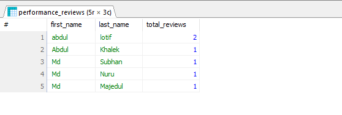

# Lab Report 02
**Course:** Database Management System  (CSEC-322)<br />
**Assignment On:** Lab Aggregation Function <br/>
## Create and Use Database
```sql
CREATE DATABASE dbms_assignment_1;
USE dbms_assignment_1;
```

## Create Tables
```sql
CREATE TABLE departments( 
    d_id INT PRIMARY KEY AUTO_INCREMENT,
    d_name VARCHAR(50) NOT NULL
);


CREATE TABLE employees (
    e_id INT PRIMARY KEY AUTO_INCREMENT,
    first_name VARCHAR(50) NOT NULL,
    last_name VARCHAR(50),
    email VARCHAR(80) UNIQUE NOT NULL,
    phone_number VARCHAR(15),
    hire_date DATE NOT NULL,
    d_id INT,
    job_title VARCHAR(100),
    FOREIGN KEY (d_id) REFERENCES departments(d_id) ON DELETE SET NULL
);

CREATE TABLE performance_reviews (
    r_id INT PRIMARY KEY AUTO_INCREMENT,
    e_id INT,
    review_date DATE NOT NULL,
    sales_performance DECIMAL(5,2),
    customer_feedback DECIMAL(5,2),
    project_completion DECIMAL(5,2),
    overall_rating DECIMAL(5,2),
    FOREIGN KEY(e_id) REFERENCES employees(e_id) ON DELETE CASCADE
);
```

## Insert Sample Data
```sql
INSERT INTO departments (d_name)
VALUES 
    ('Sales'),
    ('HR'),
    ('Marketing'),
    ('Development'),
    ('Finance');

-- Insert sample data into the employees table
INSERT INTO employees (first_name, last_name, email, phone_number, hire_date, d_id, job_title)
VALUES
    ('abdul', 'lotif, 'lotif@gmail.com', '01723675633', '2022-01-15', 1, 'Sales Manager'),
    ('Abdul', 'Khalek', 'Khalek@gmail.com','01723675639', '2018-03-22', 2, 'HR Manager'),
    ('Md', 'Subhan', 'Subhan@gmail.com', '01723675637, '2022-06-10', 3, 'Marketing Specialist'),
    ('Md', 'Nuru', 'nuru@gmail.com', '0172367563', '2023-07-01', 4, 'Software Engineer'),
    ('Md', 'Majedul', 'majedul@gmail.com', '017236756333', '2017-11-30', 5, 'Accountant');
INSERT INTO performance_reviews (e_id, review_date, sales_performance, customer_feedback, project_completion, overall_rating)
VALUES
    (1, '2024-05-01', 87.50, 98.00, 95.00, 81.16),
    (1, '2024-05-01', 83.00, 93.50, 98.50, 94.00),
    (2, '2024-06-15', 71.00, 89.00, 89.00, 82.00),
    (3, '2024-07-20', 78.00, 84.00, 79.00, 75.66),
    (4, '2024-08-30', 92.00, 90.00, 91.00, 93.66),
    (5, '2024-09-10', 87.00, 81.00, 82.00, 84.33);

```

## Question_1: Total number of performance reviews conducted
```sql
SELECT COUNT(*) AS total_reviews
FROM performance_reviews;
```
### Output of Quesion_1


## Question_2: Average salse performance score of all employees
```sql
SELECT AVG(sales_performance) AS average_sales_performance
FROM performance_reviews;
```
### Output of Quesion_2


## Question_3: Highest customer feedback score
```sql
SELECT MAX(customer_feedback) AS highest_customer_feedback
FROM performance_reviews;
```
### Output of Quesion_3


## Question_4: Total project completion score for each department
```sql
SELECT e_id, SUM(project_completion) AS total_project_completion
FROM performance_reviews
GROUP BY e_id;
```
### Output of Quesion_4


## Question_5: Average sales, customer feedback, and project completion scores for each department
```sql
SELECT d_id,
       (SELECT d_name FROM departments WHERE departments.d_id = employees.d_id) AS department_name,
       AVG(sales_performance) AS average_sales_performance,
       COUNT(r_id) AS total_reviews
FROM employees, performance_reviews
WHERE employees.e_id = performance_reviews.e_id
GROUP BY d_id;

```
### Output of Quesion_5


## Question_6: Find the department with an average sales performance score greater than 80
```sql
SELECT e_id, AVG(sales_performance) AS average_sales_performance
FROM performance_reviews
GROUP BY e_id
HAVING AVG(sales_performance) > 80;
```
### Output of Quesion_6


## Question_7: Count the number of distinct review dates
```sql

SELECT COUNT(DISTINCT review_date) AS distinct_review_dates
FROM performance_reviews;
```
### Output of Quesion_7


## Question_8: List all employee names along with their total number of reviews
```sql
SELECT first_name, last_name, 
       (SELECT COUNT(*) 
        FROM performance_reviews pr 
        WHERE pr.e_id = e.e_id) AS total_reviews
FROM employees e;

```
### Output of Quesion_8


## Question_9: Find the average sales performance and the total number of reviews for each department
```sql
SELECT d.d_name AS department_name,
       (SELECT AVG(pr.sales_performance)
        FROM performance_reviews pr
        WHERE pr.e_id IN (SELECT e.e_id FROM employees WHERE e.d_id = d.d_id)) AS average_sales_performance,
       (SELECT COUNT(*)
        FROM performance_reviews pr
        WHERE pr.e_id IN (SELECT e.e_id  FROM employees e WHERE e.d_id = d.d_id)) AS total_reviews
FROM departments d;
```
### Output of Quesion_9

